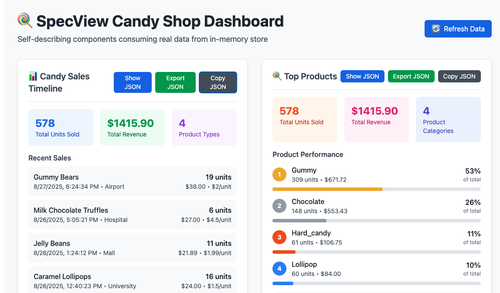
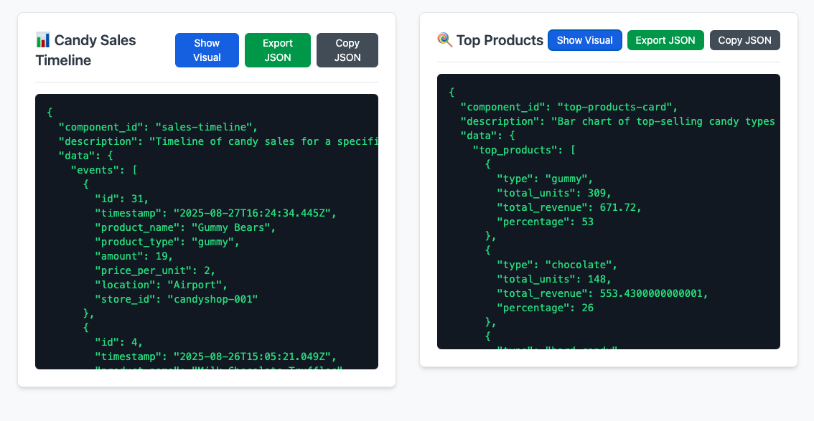
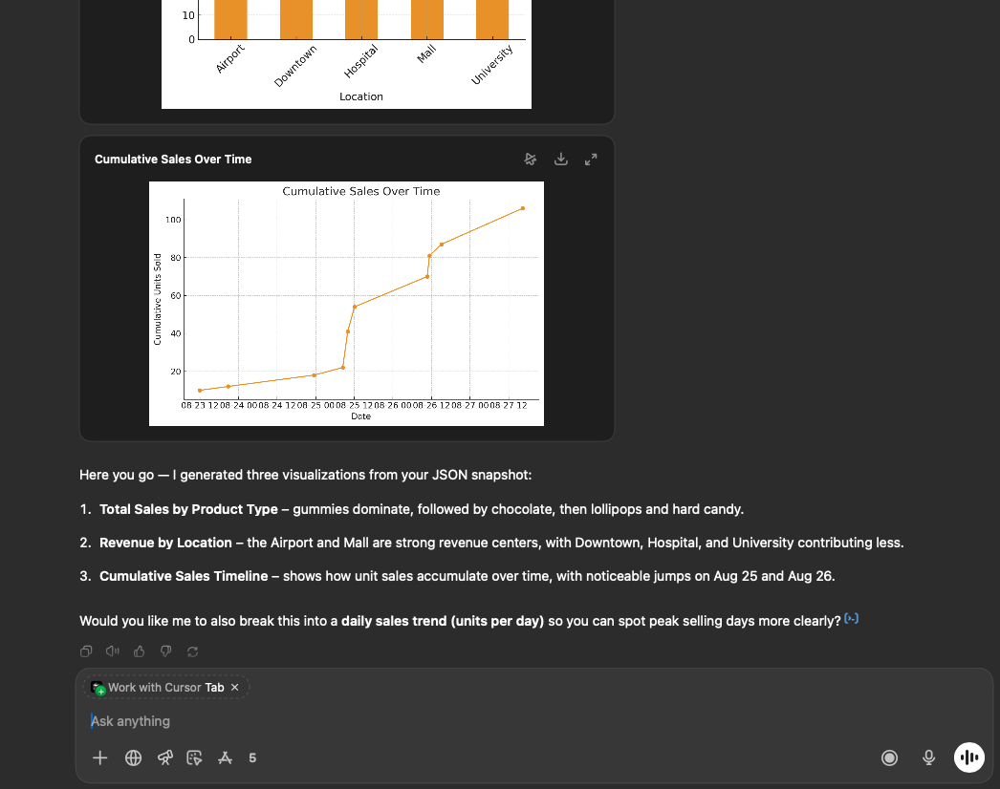

# 🧩 SpecView

**Self-describing components for AI-native, human-friendly analytics.**

---

## ✨ What is SpecView?

**SpecView** is a framework for building **intelligent visual components** that explain themselves.  
Every component in SpecView exports a structured `SelfDescribingOutput` — making it:

- 🧠 **LLM-ready**: Understandable by large language models for reasoning, summarizing, and reporting
- 🖼️ **Dual-mode**: Switch between visual charts and JSON metadata
- 📦 **Exportable**: Output to JSON, CSV, GeoJSON, HTML, or PDF
- 📚 **Auditable**: Automatically includes filters, timestamps, and context

Whether you're building dashboards, investigation tools, or AI-assisted reporting engines — **SpecView** makes each component **a shareable insight block**.

---

## 📦 Packages

```bash
specview/
├── docs/                  # Technical specs, architecture, and design notes
├── examples/              # Sample apps and dashboards
└── packages/
    ├── core/              # Type definitions and core interfaces
    ├── react/             # Hooks, base classes, HOCs for React integration
    ├── export-utils/      # Export formats and snapshot tools
    └── components/        # Pre-built or sample components (timeline, network, etc.)
```

⸻

🔍 Why SpecView?

Feature	Benefit
🧠 AI-compatible output	Let LLMs parse, reason, and generate from components
🧾 Embedded metadata	Every component knows its filters, target, context
🖼️ Dual view modes	Visual or structured JSON — toggle instantly
📄 Exportable reports	Generate JSON/CSV/PDF from any component
🔁 Snapshot support	Save, rehydrate, and share full dashboards


⸻

��️ Getting Started

📖 **📚 [Complete HOWTO Guide](HOWTO.md)** - Learn how to use SpecView in your projects

Coming soon — once packages are published.

For now, clone the repo and explore:

git clone https://github.com/meirm/specview
cd specview
pnpm install # or yarn / npm

⸻

## 🎯 Demo: SelfDescribingComponents in Action

See SpecView in action with our interactive demo showcasing SelfDescribingComponents consuming real data:

### Visual Mode - Human-Friendly Interface


### JSON Mode - AI-Compatible Output


### AI Interpretation - ChatGPT Understanding the Data


**Try the demo yourself:**
```bash
cd examples/demo-app
npm install
npm run dev
```

**Features demonstrated:**
- 🗄️ **Real Data Integration**: Components consume data from an in-memory store
- 🔄 **Live Refresh**: Generate new data with updated timestamps
- 🖼️ **Dual View Mode**: Switch between visual charts and structured JSON
- 📦 **Export Ready**: Download JSON files or copy to clipboard
- 🤖 **AI Compatible**: Structured output that LLMs can understand and process
- 🧠 **AI Interpretation**: ChatGPT can analyze and reason about the structured data

⸻

🧩 Example: Self-Describing Output

{
  "component_id": "timeline-analysis",
  "description": "Timeline of communication events",
  "data": {
    "events": [...],
    "summary": {...}
  },
  "metadata": {
    "store_id": "+523336090820",
    "filters": {
      "date_range": { "start": "...", "end": "..." }
    },
    "generated_at": "2025-08-27T14:00:00Z"
  }
}


⸻

📚 Status

✅ Core interfaces defined
✅ React hook + base class
✅ Export utilities
🚧 Snapshot dashboard support
🚧 Component registry
🚧 Server-side rendering

⸻

👥 Authors
	•	meirm@cyborg.fi
	•	ChatGPT as coding copilot

⸻

📜 License

MIT — open for everyone.
Use it in commercial, private, or open-source projects.

⸻

🚀 Vision

We believe the future of interfaces is AI-readable by default.
SpecView lets your UI talk to agents, humans, or itself — with no translation layer.

